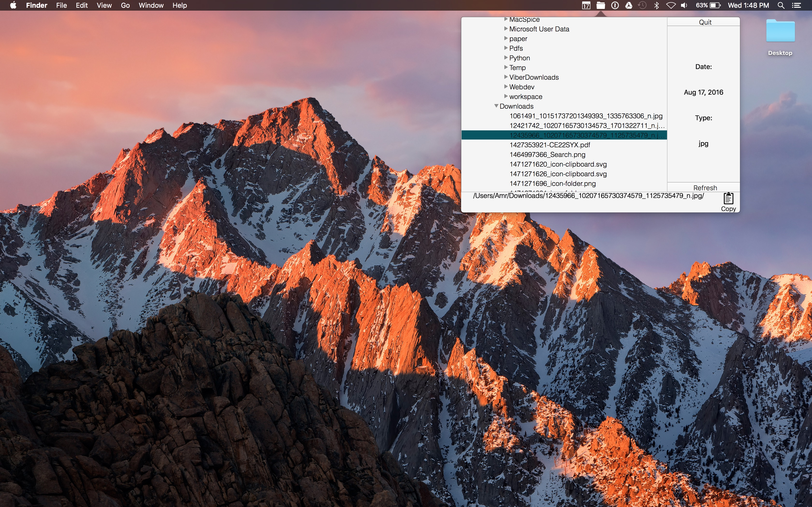
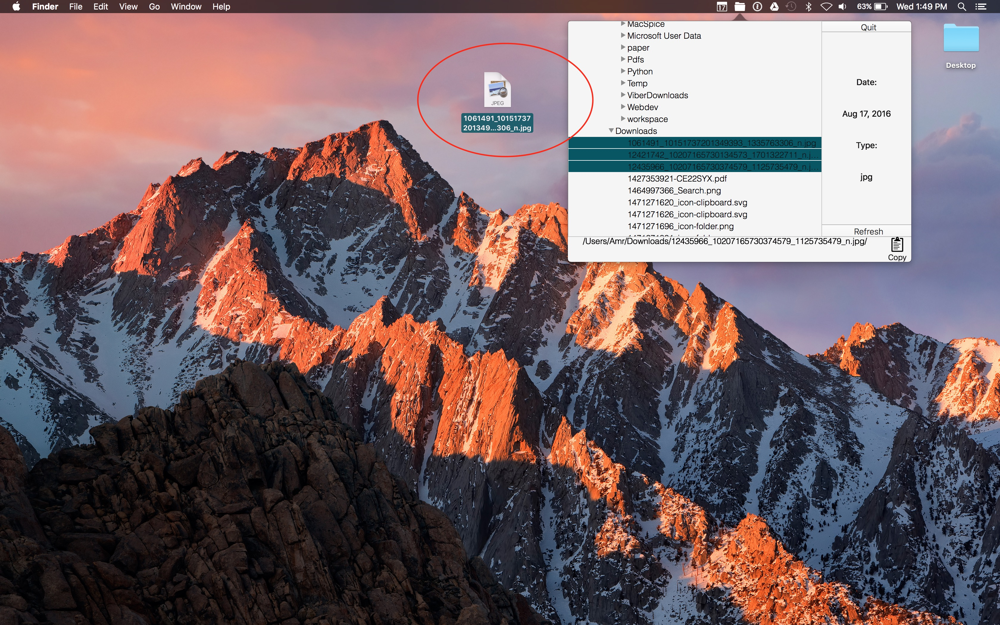
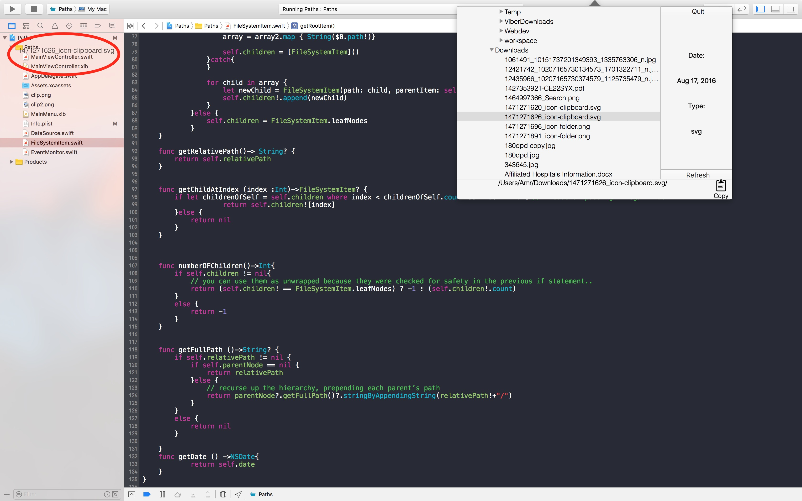
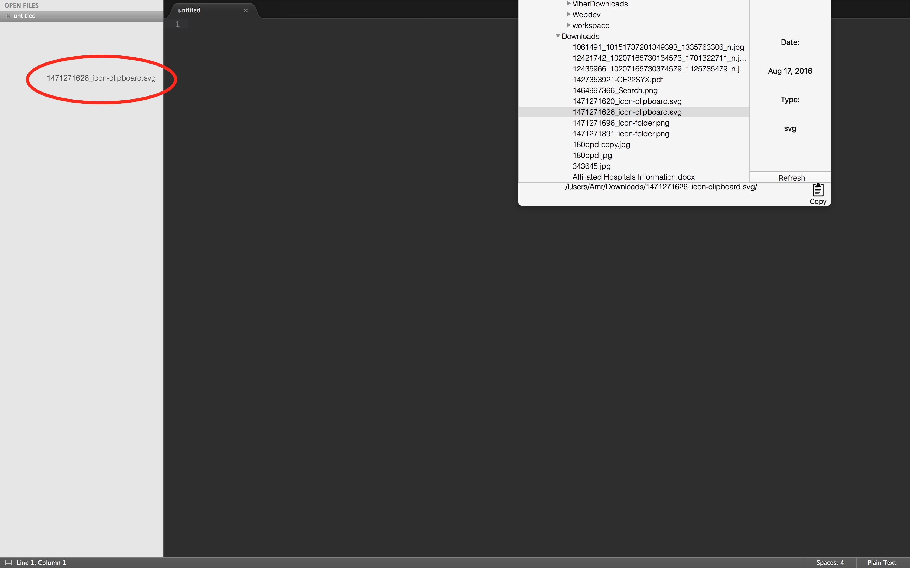

# Paths
###Paths is a mini widget that runs in your mac's menu bar to navigate your Finder's/File system's hierarchy. 

\*\*\* The motivation behined this mini project is that I was frustrated having to switch windows, when in full screen, to drag files to my code editors and having to do multiple clicks before getting the paths to my files. \*\*\*

###Paths allows you to navigate your finders's/file System's hierarchy, drag and drop files to your apps or editors, as well as copying the paths to your files and seeing their extensions (incase you need to reference them in your code).  

### To install, just download/clone the repo and check the App/Archive folder. 

*Some screenshots of what it looks like..*

###Running on desktop 

###Dragging and dropping files to desktop 

###Dragging and dropping files to Xcode project navigator while in full screen

###Sublime text for comparison 

